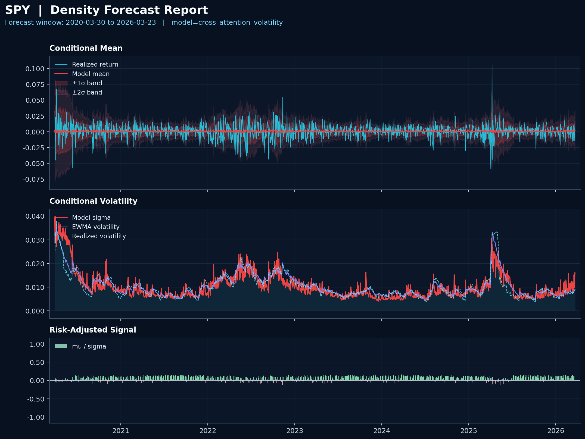

Density Model
=============

Public repo for cross-asset conditional-density forecasting on panel data.

## Quick Start

Run the full end-to-end demo:

```bash
bash scripts/run_demo.sh
```

This demo is only a public example of the workflow on daily Yahoo data.

Primary outputs are written under:

- `artifacts/demo/`
- `artifacts/demo/garch/`

## Install

For the full public workflow (Python 3.10+):

```bash
pip install -r requirements.txt
```

## Intent

This repository is a forecasting tool built for panel settings where each asset
can benefit from cross-sectional context. The core modeling idea is simple:
every asset can attend to every other asset in the provided dataset, so the
forecast for one name is informed by the rest of the panel.

The repo is intentionally simple. Its real purpose is not to be a complete
production system on the bundled demo universe. Its purpose is to provide a
clean, public implementation that you can apply to your own panel data.

The practical expectation is:

- the model will deliver proactive volatility measurements when it can, and
  reactive predictions when it must,
- the secret sauce is features carrying useful predictive information,
- if the predictors do not carry useful forward-looking information, the model
  will behave much more like a reactive volatility model such as GARCH.

This framing follows:

Goulet Coulombe, P., Frenette, M., & Klieber, K. (2025). *From reactive to
proactive volatility modeling with hemisphere neural networks*. *Journal of
Applied Econometrics*.

Example forecast report for SPY:



## Model

The default model is a causal cross-asset transformer:

- per-asset temporal encoding over rolling return windows,
- cross-asset attention on the final temporal state,
- probabilistic heads for conditional mean and conditional scale,
- Gaussian likelihood training on next-period returns.

The output for each asset and forecast date is:

- `mu`: conditional mean forecast,
- `sigma`: conditional standard deviation forecast.

## Objective

Training uses the Gaussian negative log-likelihood:

$$
\mathcal{L}_{\mathrm{NLL}}
=
\frac{1}{2}\log(2\pi)
+
\log \sigma
+
\frac{(y-\mu)^2}{2\sigma^2}
$$

That is the only objective used by the default model.

A natural extension would be to replace the Gaussian likelihood with a
Student-t likelihood when heavier tails are important.

## Scope

The bundled data path is only a demo.

The public demo uses Yahoo daily data as an example workflow, not as the
intended ceiling of the repository.

The intended use is:

- bring your own panel data,
- keep the same public feature contract,
- retrain on a panel where relevant predictors and cross-sectional structure are
  actually present.

The built-in demo is useful for:

- showing the workflow,
- validating the training / prediction / evaluation stack,
- illustrating the forecasting output format.

It is not meant to be interpreted as a production alpha claim.

## Compute

The model runs on both CPU and GPU.

CPU works for portability and debugging.
GPU is preferred for actual training runs.

## Repository Layout

- [scripts](/mnt/c/users/user/dropbox/density_model/scripts): public CLI entrypoints
- [configs](/mnt/c/users/user/dropbox/density_model/configs): user-facing YAML configs
- [src/density_model](/mnt/c/users/user/dropbox/density_model/src/density_model): package code
- [tests](/mnt/c/users/user/dropbox/density_model/tests): pytest coverage
- [docs/cli_cheat_sheet.md](/mnt/c/users/user/dropbox/density_model/docs/cli_cheat_sheet.md): command reference
