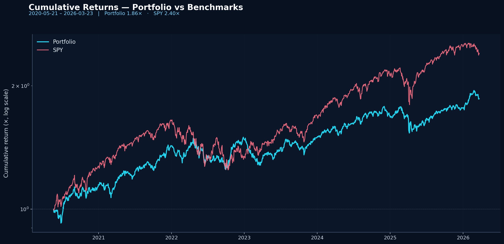
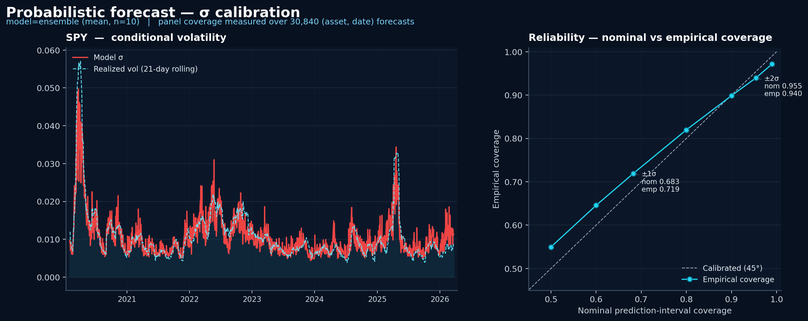
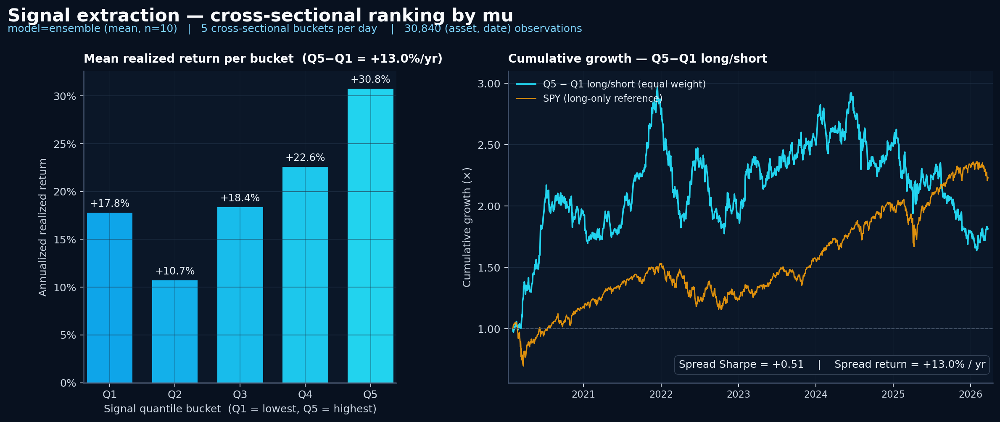

# density_model

A panel density-forecasting library for financial time series.

Train a causal transformer to emit a full **Gaussian predictive distribution
(μ, σ)** per asset per forecast date, then run it through every production
lane you'd expect — single-GPU training, DDP, Optuna tuning, bagging
ensembles, benchmarking against classical baselines (AR(1), unconditional
mean, GARCH(1,1)), rolling inference, per-asset forecast plots, and
density-aware metrics with skill scores. All driven by YAML configs
validated with Pydantic v2.

A working portfolio-construction example is included to illustrate one
downstream use of the (μ, σ) outputs — it's a reference path, not a
maintained portfolio library. The plot below was produced by the included
example.

---

## Showcase

The plot below is the *end* of the pipeline — what a downstream
consumer of the (μ, σ) forecasts does with them. The three sections
beneath it (§1 probabilistic forecast → §2 cross-sectional signal →
§3 portfolio) are the proof of how it gets built.

20 US equities, 2020-05 → 2026-03, daily rebalance. Density forecasts
from a 10-estimator bagging ensemble drive a mean-variance portfolio
under a full-investment constraint (`∑w = 1`, shorting allowed).



```
Sharpe          = +0.91
Annual return   = +11.25%
Annual vol      =  12.56%
Max drawdown    = -16.06%
Hit rate        = 54.6%

Mean leverage   = 1.43×        Mean turnover = 0.82
Effective N     = 7.20         (broad — uses ~7 of 20 names)
```

Re-render the plot from the bundled demo predictions:

```bash
python scripts/plot_portfolio.py --config configs/density_model/portfolio/baseline.yaml
```

Train + ensemble + run the full pipeline yourself: see
[`docs/cli_cheat_sheet.md`](docs/cli_cheat_sheet.md). Expect a GPU and a few
hours; bundled CSVs in [`data/`](data/) cover 20 US equities (2005–2026).

---

## What this is (and isn't)

**Is** — a library for training and operating panel density-forecasting
models. The core deliverable is a `predictions.csv` with `(forecast_date,
asset_id, μ, σ)` per row, plus all the infrastructure to produce, evaluate,
and benchmark it.

**Isn't** — a portfolio-construction library. The included
`scripts/construct_portfolio.py` is one example of what a downstream
consumer might do with the (μ, σ) outputs. It produces a working backtest
with sensible defaults; it is not the system to build on if your goal is
serious portfolio research. Bring your own optimizer.

**One honest caveat.** Per-step RMSE on the bundled fixtures runs at
`rmse_skill ≈ 1.00` against the unconditional-mean benchmark — the
model is not beating a naive point forecaster on raw accuracy. Its
value is in the *shape* of the predictive distribution: a calibrated
`σ` (see §1) and a cross-sectional `μ` that ranks returns (see §2).
The portfolio result in §3 comes from those two together, not from
sharper point forecasts. Verify against the bundled benchmarks:

```bash
python scripts/metrics.py \
  --config configs/density_model/yahoo_predict_next_step_ensemble.yaml \
  --reference outputs/benchmarks/unconditional_mean/predictions.csv \
  --benchmarks outputs/benchmarks/ar1/predictions.csv \
               outputs/benchmarks/garch/predictions.csv
```

---

## The pipeline, end-to-end

### 1 · Density forecasting

Two registered causal architectures, both emitting `mu | sigma` over a
panel-shaped `(B, I, T, K)` input (batch × assets × time × features):

- **`causal_cross_asset_transformer`** — temporal self-attention plus a
  cross-asset attention block on the final hidden state. Emits forecasts
  for one or more steps after the input window.
- **`causal_next_step_transformer`** — GPT-style per-position supervision
  (target = input shifted by one step) with cross-asset attention at
  every timestep. Each input position predicts the next; the t+1 forecast
  is the last position's output.

Loss is a masked Gaussian negative log-likelihood. Switch between
architectures by changing `model.name` and `features.target_mode` in the
config.

The point of forecasting a full Gaussian — not just a point μ — is that
`σ` carries the model's instantaneous risk estimate. Visible below: the
model's `σ` for SPY tracks rolling realized volatility through every
regime (left), and standardized residuals `(y - μ) / σ` cover the panel
at roughly Gaussian nominal levels (right). The ±1σ band is slightly
conservative (empirical 0.719 vs nominal 0.683) and the ±2σ band is
slightly under-covered (0.940 vs 0.955) — honest but well-behaved.



```bash
python scripts/plot_calibration.py --config configs/density_model/yahoo_predict_next_step_ensemble.yaml
```

### 2 · Signal extraction

The model's predicted `μ` carries cross-sectional ranking information.
For every forecast date the assets are z-scored on `μ` and split into
five quantile buckets; pooled across all 1,542 forecast days, the top
bucket (Q5) outperforms the bottom (Q1) by **+13.0% / year** in
realized returns. The equal-weight Q5−Q1 long/short spread runs at
**Sharpe +0.51** — a market-neutral signal layered on top of the
density forecast, not a market-beta proxy.



```bash
python scripts/plot_signal.py --config configs/density_model/yahoo_predict_next_step_ensemble.yaml
```

`σ` does not carry directional information at the 1-day horizon — it
does its job in **§1** (risk calibration) and as the optimizer's risk
input in **§3**. Use `--signal-column mu_over_sigma` to inspect the
risk-adjusted variant.

### 3 · Downstream example: portfolio construction

Included as one illustrative consumer of `predictions.csv`:

```bash
python scripts/construct_portfolio.py --config configs/density_model/portfolio/baseline.yaml
python scripts/plot_portfolio.py      --config configs/density_model/portfolio/baseline.yaml
```

Strict-no-lookahead daily backtest:

1. Read `(μ, σ)` for forecast date `t+1`
2. Build cross-sectional alpha `α = zscore(μ/σ)`
3. Estimate `Σ` from realized returns strictly before `t+1`
4. Solve `max_w α'w − (λ/2) w'Σw` subject to `1'w = 1`
5. Apply `w_t` to realized returns at `t+1`; record portfolio return

Every component (alpha builder, covariance estimator, optimizer) is a
small module under `src/density_model/portfolio/` so you can swap pieces
or replace the whole thing. **It's not a portfolio-construction lane and
won't be extended in lockstep with the forecasting library** — extend in
your own downstream code.

---

## Operating capabilities

Every lane above is a thin script driving one YAML config:

| Lane | Script | What it does |
|------|--------|--------------|
| Preprocess | `scripts/preprocess.py` | Raw CSVs → fitted preprocessing bundle + vectorized panels |
| Train (single) | `scripts/train.py` | One model, one GPU |
| Train (DDP) | `torchrun scripts/train.py` | Multi-GPU via `DistributedDataParallel` |
| Tune | `scripts/tune.py` | Optuna grid/random search over a time-series CV splitter, with median pruning and an automatically emitted `best_config.yaml` |
| Ensemble | `scripts/ensemble.py` | N bootstrap estimators with OOB-as-val early stopping and top-K pruning |
| Benchmark | `scripts/benchmark.py` | AR(1), unconditional mean, or GARCH(1,1) — write `predictions.csv` in the same schema |
| Predict | `scripts/predict.py` | Auto-detects single-model vs ensemble manifest and aggregates Gaussians (mean μ, law-of-total-variance σ) |
| Plot | `scripts/plot.py` | Per-asset 3-panel forecast report (μ ± σ bands, σ vs realized vol, μ/σ signal) |
| Calibration | `scripts/plot_calibration.py` | Two-panel σ showcase — σ vs rolling realized vol + panel-wide reliability diagram |
| Signal | `scripts/plot_signal.py` | Two-panel signal showcase — per-bucket annualized return + Q5−Q1 cumulative spread |
| Metrics | `scripts/metrics.py` | NLL / CRPS / MAE / RMSE / coverage at ±1σ / ±2σ / σ̄, with optional `--reference` for RMSE skill scores against the unconditional-mean benchmark |

Full command reference: [`docs/cli_cheat_sheet.md`](docs/cli_cheat_sheet.md).

---

## Quickstart

```bash
# Python 3.10+
pip install -e .

# Feature CSVs (one row per (asset, date)) live in data/:
#   data/train_features.csv  data/val_features.csv  data/predict_features.csv
# Required columns: date, asset_id, return, ticker

# Single-model lane: preprocess → train → predict → plot → metrics
python scripts/preprocess.py --config configs/density_model/yahoo_volatility.yaml
python scripts/train.py      --config configs/density_model/yahoo_volatility.yaml
python scripts/predict.py    --config configs/density_model/yahoo_predict.yaml
python scripts/plot.py       --config configs/density_model/yahoo_predict.yaml
python scripts/metrics.py    --config configs/density_model/yahoo_predict.yaml
```

Outputs land at `outputs/<experiment_name>/` with:
- `preprocessing.json` — fitted per-asset scaler + global tokenizer
- `model.pt` + `training_manifest.json`
- `predictions.csv` — rolling Gaussian forecasts
- `plots/<asset>_report.png` — per-asset visualizations
- `metrics.{json,md}` + `metrics_per_asset.csv`

Tuning, ensemble, DDP, and benchmark variants live alongside in
[`configs/density_model/`](configs/density_model/).

---

## Repo layout

```
configs/
  density_model/
    yahoo_volatility*.yaml          single-model + DDP + smoke configs
    yahoo_volatility_tuning*.yaml   Optuna search configs
    yahoo_volatility_ensemble*.yaml bagging configs
    yahoo_predict*.yaml             inference configs (matching names)
    benchmarks/                     AR(1), UnconditionalMean, GARCH(1,1)
    portfolio/baseline.yaml         downstream example config
data/                               train/val/predict feature CSVs
docs/
  cli_cheat_sheet.md                full command reference
  images/                           README assets
outputs/                            per-run artifacts (gitignored)
scripts/                            preprocess, train, tune, ensemble,
                                    benchmark, predict, plot, metrics,
                                    construct_portfolio, plot_portfolio
src/density_model/
  models/                           causal_cross_asset, causal_next_step,
                                    temporal_only — all @register'd
  portfolio/                        downstream example (alpha, risk model,
                                    optimizer, backtest, metrics, plot)
  shared/
    benchmarks/                     AR(1), UnconditionalMean, GARCH(1,1)
    config/panel_schema.py          every Pydantic config in the library
    data/panel/                     vectorizer, dataset, splitter,
                                    schema, calendar, sources
    ensembling/panel/               bagging runner + bootstrappers +
                                    pruning + Gaussian aggregation
    evaluation/                     panel_plot + panel_metrics
    inference/                      panel_predictor (auto single-vs-
                                    ensemble dispatch)
    preprocessing/panel/            per-asset scaler + tokenizer + bundle
    training/                       panel_trainer + DDP + losses + run
    tuning/panel/                   time-series CV objective + Optuna
                                    study + best-config emitter
tests/                              pytest suite
```

Full map: [`AGENTS.md`](AGENTS.md).

---

## Stack

- **Python 3.10+**, **PyTorch**
- **Pydantic v2** — config validation
- **Optuna** — hyperparameter tuning
- **arch** — GARCH(1,1) benchmark
- **pandas_market_calendars** — XNYS session normalization
- **matplotlib** — forecast + portfolio plots
- **pytest** — tests

---

## For coding agents

Read [`AGENTS.md`](AGENTS.md) first — repo map, "task → edit site" table,
and conventions.

## For everyone else

- Commands: [`docs/cli_cheat_sheet.md`](docs/cli_cheat_sheet.md)
- Extension points + editing rules: [`AGENTS.md`](AGENTS.md)
- Hard rules: [`CONVENTION.md`](CONVENTION.md)
- Deferred work: [`TODO.md`](TODO.md)
- Design ideas: [`IDEA.md`](IDEA.md)
